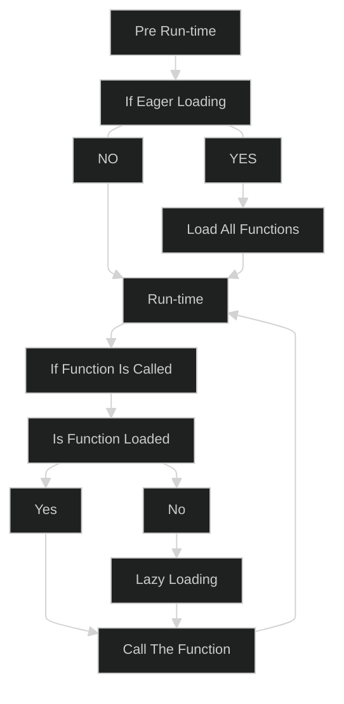

# C++/OpenGL (No Build System)

_" I am learning OpenGL without any external Build System. I assume that I can automate all the linking an compilation without CMake as mentioned in the course that I am following (learnopengl.com). "_

<br>

### Policies

**AI Policy** : I can use AI for learning and debugging, but I can not use any AI code. **0% of AI code**. _(Pasting even an AI generated character is forbidden.)_
> No AI use in related documentations as well (.md, .pdf, etc.) .

**C Policy** : I am allowed to implement the build configuration in C, **BUT**, all of the OpenGL code and other self-written utilities must be C++ _(Orthodox C++ counts as C use)_.
> Why? Because I lack in C++ programming skills.

**Abstraction Policy** : Since the language of choice is C++, Object Orientation programming paradigm must be adapted and a proper layer of abstraction must be made.

**Compiler Policy** : I will be using GCC/G++ to compile the files _(majorly to not get stuck in MCVC linkage exceptions)_. 

**Compilation Policy** : This project will be considered completed when I could use its abstraction layer to build something meaningful.
> RESULT.md must be made explaining how the final project (use of the abstraction) is meaningful.

**External Library Policy** : I am not allowed to copy paste any external work into my code _(unless its a standard like lib stb)_.
> However, I am allowed to test their work for debugging and it is valid for me to implement their algorithms.

<br>

### This Repository
_This section is updated every commit._

<br>

\<nothing>

<br>
<hr>

# Progress

<br>

## Build Configuration

<u><i><div align="right">9th September 2026</div></i></u>
The first and the most important thing that I have to resolve is _compilation of my C++ files_. Since I am using pre-compiled libraries like GLFW, I need a stable and cross-OS mechanism to correctly compile and link all the binaries and libraries together.

<br>

#### Static Linking
_Static Linking_ involves taking the libraries' files and directly concatinating them with the compiled objects and then resolving the calls internally. This is very easily done via `-L` and `-l` flags.

`-L` : Used to hint the compiler (linker) _" **where to look?** "_.

`-l` : Used to hint the compiler (linker) _" **what to look?** "_.

> When `-lname` is used to search for a file, `name` is not the actual file that is searched. GCC and G++ add a prefix `lib` in front of all the file names that they search, thus, `libname` is searched. To prevent the prefix-ing, `-l:` can be used.

`-l:` : Used to hint the compiler (linker) _" **what to look?** "_ **without the prefix**.

<br>

#### Dynamic Linking
_Dynamic Linking_ involves taking the libraries' files and prepare the program such that they get linked at run time, such linking is called external linking. External linking means that, the actual process will not have the functions, but it will know where in the memory they are kept. So, at run-time, the operating system will load the functions into the primary memory so that the functions could be called.

If all the functions are loaded at the start of the program, it is called _**Eager** Dynamic Linking_, but if a function is loaded upon its first call, its called _**Lazy** Dynamic Linking_.


<div align="center">


</div>

<br>

#### COFF and ELF binary types
In Windows, for dynamic linking, the `.dll` files must be in the same foler as the `.exe`. This is how Windows functions, it searches only the `.exe`'s directory or the _system paths_. This perticular behavious is because the binaries in Windows are of COFF type.

COFF stands for _Common Object File Format_, meaning of the name is straigtforward. All the other binaries will be linked with the same `.dll` if the search happens.

> `SetDllDirectory()` can be used from inside C/C++ code to change the run-time search path.

<br>

In a POSIX complined operating system though, the binaries are NOT of COFF type, they are of ELF type. ELF stands for _Executable and Linkable Format_, meaning of the name is straigtforward. Each binary get to choose what `.so` files they get to link with, irrespective to where they are in the entire memory.

`-rpath` : Used to embed **run-time** paths into the binary. These paths will be searched at the time of run-time (dynamic) linking.

> Since in Windows we always check _only_ the active run-time path directory, `-rpath` does not make any sense.

<br>

#### COFF for POSIX
I am going to implement COFF type linking for POSIX, which is extreamly easy. All I have to do is set the run-time search path as the directory of the executable and make sure that all the libraries needed are present in the directory.

Why? There is no such reason apart from its easier to code. I will (in future) implement a run-time loader for cross OS use if I feel the need.

**Common Object/Library Linker** or COLL is what I will call my cross OS build system.

<br>

#### Using the build system

<u><i><div align="right">13th September 2026</div></i></u>

The build system exists in the directory `./build_system` and is contained completely in just one header, no implementation needed.

`config { ... }` : All of configuration must be enclosed in the config block.

`in` : Used to add input files that the compiler takes, can take `.c`, `.i`, `.o`, any that you want to give it.

`out` : Used to define the name of the output executable.

```C
#include "./build_system/COLL.h"

config {

    libc; // Enables the default libc linking that the compiler does.
    
    in main.c; // Adds an input file 'main.c' to the compiler.

    out run; // Defines the output executable name.

    run; // Runs the build after building.

}
```

<br>

`link` : Used to _**dynamically**_ link a library.

`static_link` : Used to _**statically**_ link a library.

`search` : Used to add search paths so that the compiler and the linker can find the libraries.
> When `search` is used, the path is passed via -L and -I both. 

```
config {
    /* Order of instructions does NOT matter. */

    libc;

    in main.c; // Uses a function named 'add' that is not defined.
    
    static_link "libadd.o"; // Static Linking of the 'add' function used in the main.c

    out run;

    search "./libadd"
    
    run;

}
```

<br>

This entire build configuration is nothing but a C file. Logic can be integrated to better shape the build.

<br>

#### Building
As of now, the build system is just a saved compilation string, nothing else. It would truly be called a build system when it could handle run-time linking with no exceptions.

Right now, dynamic linking is not handled, for that, I would have to implement the build directory.

`at` : If this is used, then the build will no longer happen in the same directory, it will happen in the directory given to it.

> For simplity, let us assume that we will always be defining the build directory location as `at "./build";` referred to as _" build "_.

In the build, we will have all of the files that make up the final executable.

```
[_/] Build
 |   { Contains the full build. }
 |
 |~~~~~ [_/] lib
 |           { Contains all the static/dynamic libraries. }
 |       
 |~~~~~ [_/] src
 |           { Contains all the input files. }
 |       
 |~~~~~ [_/] dep
 |           { Contains all the dependencies. }
 |
 |~~~~~ |_=| build.h { Build System Standalone Header }
 |~~~~~ |_=| build.c { Parsed Build Configuration }
```

The `build.c` can be re-compiled and ran to re-build the full directory (re-written by default).
> Cross OS run will demand a re-build.

The build configuration will be parsed, the file paths and search paths will all be changed relative (according to) the build directory.

**Immediate Objective** is to only be able to copy all the dynamic libraries into the `at`-directory and then call it a consistent build system.

<br>

#### The Build System is completed

<u><i><div align="right">20th September 2026</div></i></u>

_The build system is up and running with ALL the major functionalities. I wont be documenting it right now, I have exams coming up, but I am really happy with the output._

<div align="center">


</div>

<br>


<hr>

<div align="center">

_No AI was used in the making of this Markdown file._

_(I am not correcting my spelling mistakes, they are the part of this development.)_

</div>

